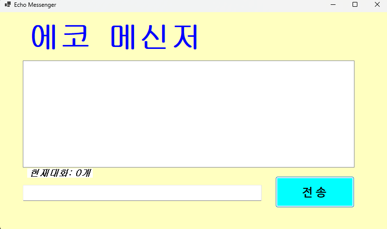
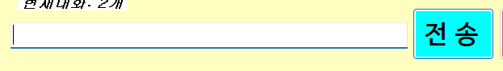

# (C# 코딩 3주차) 에코 메신저 (Echo Messenger)
 -- 22017004 컴퓨터 SW 강희준 --

## 개요- C# 프로그래밍 학습- 

한줄 소개 : 사용자의 입력( 키보드, 마우스)를 받아 처리하는 간단 프로그램

사용한 플랫폼 :
    - C#, .NET Windows Forms, Visual Studio, GitHub

사용한 컨트롤 : 
    - Label, ListBox, TextBox, Button

사용한 기술:
    - 이벤트 처리, 데이터 바인딩, 문자열 조작, UI 디자인, 예외 처리
    - void 메서드, if 조건문, for 반복문, DateTime 클래스, Trim() 함수
    - MessageBox.Show() 함수, ListBox.Items.Add(), ListBox.Items.Remove(), TextBox.Clear(), TextBox.Focus()
    - VISUAL STUDIO의 디자이너 기능 활용
    - GitHub를 통한 버전 관리 및 코드 공유
  

핵심기능:
    
    * 프로그램 기본 ui 및 데이터 연동 *
    
    1. UI 구성
    ▶ Label(표시), TextBox(입력), Button(전송), ListBox(대화창)를 배치 후 간단한 디자인.
    2. 전송 기능
    ▶ 전송 버튼 클릭 시 TextBox의 텍스트를 ListBox의 항목(Items)으로 추가.
    3. 입력창 정리
    ▶ 추가 직후 TextBox의 내용을 비워(Clear) 다음 입력을 준비.
    4. 입력창에 입력 포커스 갖다 놓기
    ▶ 전송 후에 커서를 자동으로 입력창에 두게함.
   
    * 사용자 편의성(UX) 강화 *
    
    1. 엔터키로 전송하기
    ▶ 마우스 클릭 대신 키보드의 Enter 키를 눌러도 메시지가 전송
    2. 입력 방어
    ▶ 내용이 없는 빈 문자열이나 공백(Space)만 있을 때는 메시지가 전송되지 않도록 방지

    * 데이터 가공 및 상태 표시 *
    
    1. 타임스탬프 추가
    ▶ 메시지 앞에 현재 시간([14:20:05])을 자동으로 결합하여 리스트에 출력
    2. 메시지 카운팅
    ▶ 현재 리스트에 쌓인 총 메시지 개수를 계산하여 하단 Label에 실시간으로 업데이트
    3. 문자열 정제
    ▶ 사용자가 입력한 메시지의 앞뒤 불필요한 공백을 Trim() 함수로 제거하여 출력

    * 데이터 관리 및 심화 기능 *

    1. 선택 항목 삭제 
    ▶ ListBox에서 특정 항목 선택 후 '삭제' 버튼 클릭시  해당 항목만 목록에서 제거(선택 항목 없을 시 오류 팝업)
    2. 전체 초기화
    ▶ '대화 기록 삭제' 버튼을 클릭하면 리스트의 모든 내용을 한 번에 지움
    3. 글자 수 제한
    ▶ 입력창에 글자 수를 50자로 제한, 초과시 사용자에게 경고 메시지를 띄우고 전송을 차단.

    

...- 화면구성: ....
## 실행 화면 (과제1) - 기본UI 및 데이터 연동

 
- 과제 내용-  
- 1. UI 구성
    ▶ Label(표시), TextBox(입력), Button(전송), ListBox(대화창)를 배치 후 간단한 디자인.
    2. 전송 기능
    ▶ 전송 버튼 클릭 시 TextBox의 텍스트를 ListBox의 항목(Items)으로 추가.
    3. 입력창 정리
    ▶ 추가 직후 TextBox의 내용을 비워(Clear) 다음 입력을 준비.
    4. 입력창에 입력 포커스 갖다 놓기
    ▶ 전송 후에 커서를 자동으로 입력창에 두게함.